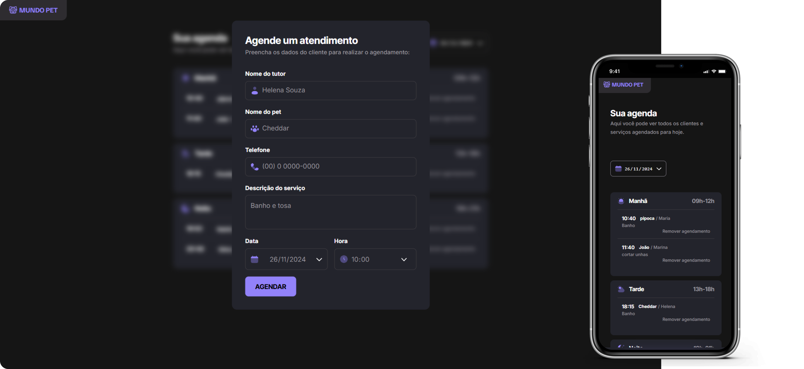

# Agendamento Pet Shop

<div align="center">
    
</div>

## Projeto
> Formação FullStack - Rocketseat

Este é um sistema para gerenciar agendamentos em um Pet Shop, permitindo ao usuário adicionar, visualizar, filtrar e excluir agendamentos. Desenvolvido com foco em aprendizado e prática de desenvolvimento frontend e backend antes do framework.

## ✨ Funcionalidades da Aplicação
- **Adicionar Agendamentos:** Permite cadastrar um novo agendamento com as informações necessárias.
- **Visualizar Agendamentos por Período:** Lista agendamentos organizados em manhã, tarde e noite.
- **Excluir Agendamentos:** O usuário pode remover um agendamento indesejado.
- **Filtrar por Data:** Os agendamentos podem ser filtrados para facilitar a busca por informações específicas.

### 📋 Detalhes da Implementação

#### Gerenciamento de Agendamentos

1. O usuário pode adicionar novos agendamentos informando dados como cliente, serviço, data e período (manhã, tarde ou noite).
2. A exclusão de agendamentos é feita de forma simples, garantindo uma interface limpa e intuitiva.

#### Filtro de Períodos e Datas

1. Os agendamentos são exibidos automaticamente organizados por período.
2. É possível aplicar filtros personalizados por data, facilitando a busca por informações específicas.

#### Integração com JSON Server

1. Os dados dos agendamentos são armazenados em um arquivo server.json que simula uma API REST.
2. Requisições como GET e DELETE são feitas para manipular os dados em tempo real.

## 🛠️ Tecnologias Utilizadas

- HTML
- CSS
- JavaScript
- JSON Server (para simulação do backend)

## 📦 Dependências e Ferramentas

#### Dependências de Produção:

- dayjs: Manipulação de datas.
- json-server: Simulação de API REST com um arquivo JSON.

#### Dependências de Desenvolvimento:

- @babel/core e @babel/preset-env: Transpilar código JS moderno para navegadores mais antigos.
- babel-loader: Integração do Babel com Webpack.
- webpack e webpack-cli: Empacotamento e otimização do projeto.
- webpack-dev-server: Ambiente de desenvolvimento com hot reload.
- html-webpack-plugin: Geração automática do arquivo HTML.
- css-loader e style-loader: Processamento de estilos para o Webpack.
- copy-webpack-plugin: Copiar arquivos para a build final.

## 🖼️ Preview

A aplicação utiliza um arquivo server.json para armazenar os dados dos agendamentos durante o desenvolvimento.

#### Exemplo de retorno da API:

```json
// Exemplo de listagem de agendamentos
[
  {
    "id": 1,
    "cliente": "Maria Silva",
    "servico": "Banho e Tosa",
    "data": "2024-11-27",
    "periodo": "manhã"
  },
  {
    "id": 2,
    "cliente": "João Pereira",
    "servico": "Vacinação",
    "data": "2024-11-27",
    "periodo": "tarde"
  }
]
```